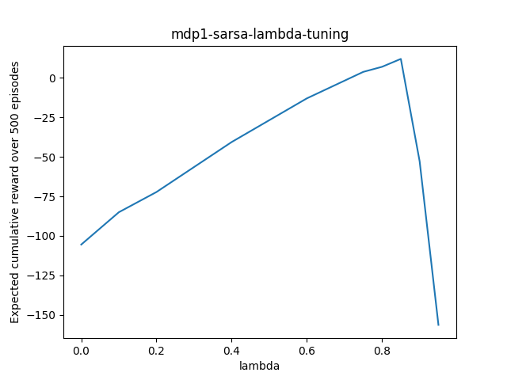

# Gridworld

Download report [here](report.pdf)

This repo contains implementions and comparison of Sarsa(&lambda;) (with accumulating or replacing traces) and Q-learning. Your agent will be placed in an environment, and will try to reach a goal state by taking actions. Its objective is to maximise expected cumulative reward. The algorithms you will implement are .

### Environment
The environment, which can be modeled by an MDP, is a grid world with a fixed start state and a fixed goal state (see figure). Some states in this world are obstacles, and thus unreachable. At the beginning of each episode, the agent is placed at the start state. The agent must move to the goal by taking the actions: up, down, left, and right. An episode is terminated if the agent reaches the goal, or if the episode reaches a certain length.

- If the agent tries to move into an obstacle, it stays put.
- The environment is slippery, i.e. the agent will move in a random direction with some small probability, irrespective of the action taken.
- Reaching the goal gives a reward of +100.
- Reaching any other state gives a reward of -1.

**Note:**

- The algorithms must work for an arbitrary-sized grid. In these experiments, however, the grid is fixed to be of size 32 &times; 32.
- The states are numbered `0` to `N-1`, where `N` is the total number of states. However, the numbers assigned to the states are permuted, which means cells `i` and `i + 1` need not be neighbours on the grid. The permutation function can be turned off for debugging.
- A random grid world can be generated by using the `--instance` parameter for the server. The experiments can be run on the gridworld instances 0 and 1.

### Code

### Results

##### Expected cumulative reward against episode number for Q-learning and Sarsa (λ=0.8) for MDP instance 0

From the experiments carried out (explained further), optimal value of the lambda was found to be 0.8 for MDP instance 0. The optimal alpha was 0.8 and optimal epsilon was 0.2 for both the instances. The figure below shows the expected cumulative reward for gamma 1 vs the number of episodes for SARSA and Q Learning algorithms respectively on MDP instance 0.

##### Expected cumulative reward against episode number for Q-learning and Sarsa(λ=0.85) for MDP instance 1

Likewise, optimal value of the lambda was found to be 0.85 for MDP instance 1. The optimal alpha was 0.8 and optimal epsilon was 0.2 for both the algorithms . The figure below shows the expected cumulative reward for gamma 1 vs the number of episodes for SARSA and Q Learning algorithms respectively on MDP instance 1.

##### Expected cumulative reward over the first 500 episodes of training for Sarsa(λ) against λ for MDP instance 0

The procedure followed to tune the lambda value once alpha was fixed at 0.8 and epsilon was fixed at 0.2 was to plot the expected cumulative reward over first 500 episodes for SARSA on both the MDP instances. The figure below shows the variation expected cumulative reward as lambda is changed for MDP instance 0. The values of lambda used are more sparse as the likely distance from observed maxima goes increasing. The optimal value of lambda was found to be around 0.8 for MDP instance 0. This value is used in all the following experiments including the graph in section 1.

##### Expected cumulative reward over the first 500 episodes of training for Sarsa(λ) against λ for MDP instance 1

Similar procedure was followed for MDP 2 to find the optimal value of lambda as shown in figure below. The optimal value of lambda was found to be around 0.85 for MDP instance 1.

##### Tuning of epsilon for Q Learning on MDP instance 0

 

For tuning the epsilon, the alpha was set to 0.1. Then, the epsilon was varied from 0.1 to 0.9 in steps of 0.1. For each value of epsilon the expected cumulative reward was plotted against the episode number on the same axes for comparison.

But, due to noise, optimal epsilon is not clearly distinguishable. So, the the plots for suboptimal epsilons were removed. The plots for epsilons 0.1, 0.2 and 0.3 are nearly identical. Hence, individual plots for each epsilon (all the plots not included in the report are available on the link at the end of this report) were then checked to arrive at a moderate value of epsilon as 0.2.

### References

- [Sarsa(&lambda;): Section 7.5, Sutton and Barto (1998)](http://incompleteideas.net/sutton/book/ebook/node77.html).
**Note:** `e(s, a)` must be reset at the beginning of each episode.
- Q-learning: Section 6.5 (page 142), Sutton and Barto (2017) of Sutton & Barto 2017.